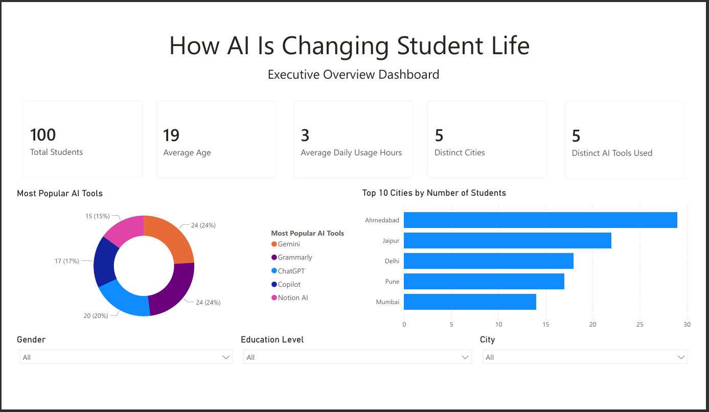

# How AI is Changing Student Life – Power BI Dashboard

A Power BI dashboard project that analyzes how artificial intelligence tools are transforming student learning, productivity, academic performance, and study habits.

---

## Project Overview

This project explores survey data from students to understand:

- Which AI tools are most popular among students
- How much time students spend using AI each day
- The impact of AI on grades and academic performance
- Differences in AI adoption across cities, genders, and education levels
- Student satisfaction with AI tools

The dashboard was built using Microsoft Power BI and demonstrates end-to-end business intelligence skills including data cleaning, DAX, visualization, and dashboard design.

---

## Dataset

- **Source:** https://www.kaggle.com/datasets/guriya79/how-ai-is-changing-student-life
- **Records:** 100 student responses
- **Fields Included:**
  - StudentID
  - Age
  - Gender
  - City
  - EducationLevel
  - AIToolUsed
  - DailyUsageHours
  - ImpactOnGrades
  - Purpose
  - SatisfactionLevel

---

## Dashboard Pages

### Executive Overview
- KPI cards:
  - Total Students
  - Average Age
  - Average Daily Usage Hours
  - Distinct Cities
  - Distinct AI Tools Used
- Donut chart: Most Popular AI Tools
- Bar chart: Top 10 Cities by Number of Students
- Interactive slicers:
  - Gender
  - Education Level
  - City

### Planned Pages
- AI Usage Patterns
- Academic Impact Analysis
- Student Satisfaction & Insights

---

## Key Insights

- ChatGPT, Gemini, and Grammarly are among the most frequently used AI tools.
- Students spend approximately 3 hours per day using AI tools.
- The dataset covers students from five major cities.
- AI is widely used across different education levels.

---

## Key DAX Measures

```DAX
Total Students = COUNTROWS(Students)

Average Age = AVERAGE(Students[Age])

Average Daily Usage Hours = AVERAGE(Students[DailyUsageHours])

Distinct Cities = DISTINCTCOUNT(Students[City])

Distinct AI Tools Used = DISTINCTCOUNT(Students[AIToolUsed])
```

---

## Screenshots

### Executive Overview



---

## Repository Structure

```text
powerbi-ai-student-life-dashboard/
├── data/
│   ├── raw/
│   │   └── how_ai_is_changing_student_life.csv
│   └── processed/
│       └── .gitkeep
├── pbix/
│   └── AI_Student_Life_Dashboard.pbix
├── screenshots/
│   └── executive-overview.png
├── docs/
│   └── .gitkeep
├── README.md
└── .gitignore
```

---

## Tools and Technologies

- Microsoft Power BI Desktop
- Power Query
- DAX (Data Analysis Expressions)
- Git and GitHub

---

## Skills Demonstrated

- Data Cleaning and Transformation
- Data Modeling
- DAX Measure Development
- KPI Design
- Interactive Dashboard Creation
- Data Storytelling
- Portfolio Documentation

---

## How to Use This Project

1. Download or clone the repository.
2. Open `pbix/AI_Student_Life_Dashboard.pbix` in Power BI Desktop.
3. Explore the dashboard and visuals.
4. Review screenshots and DAX measures.

---

## Future Enhancements

- Add more analytical dashboard pages
- Publish to Power BI Service
- Include advanced DAX calculations
- Add trend and segmentation analysis

---

## Author

**Prachi Jain**

If you found this project interesting, feel free to connect with me on LinkedIn and explore more of my data analytics portfolio projects.

---

## License

This project is licensed under the MIT License. See the LICENSE file for details.
